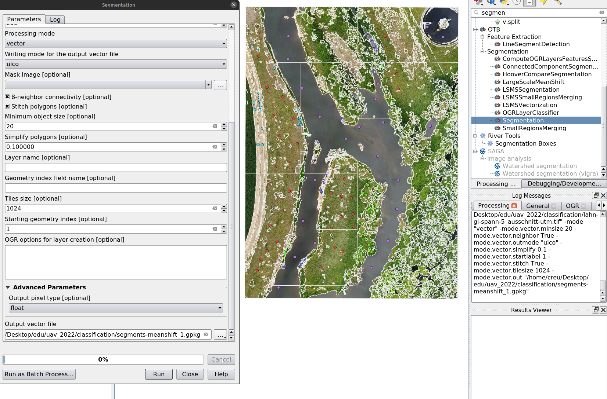
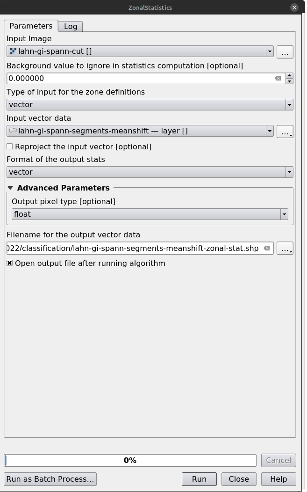
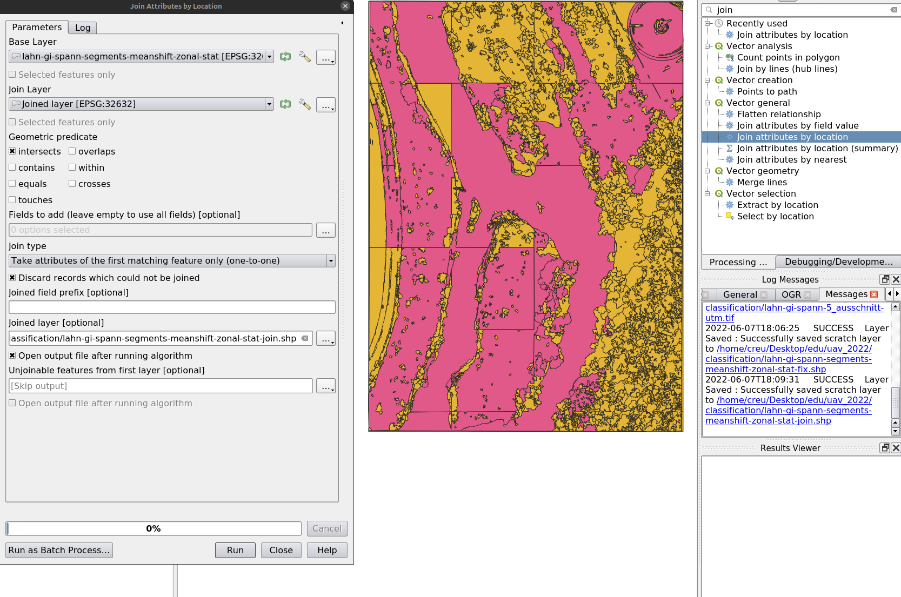
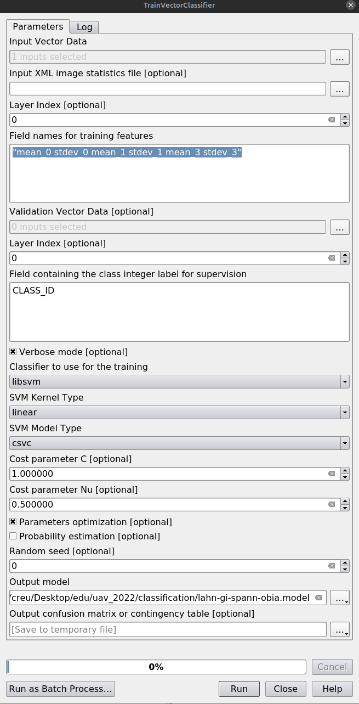
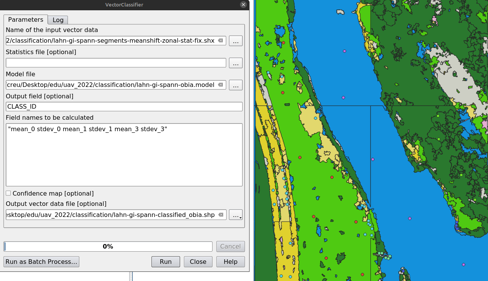
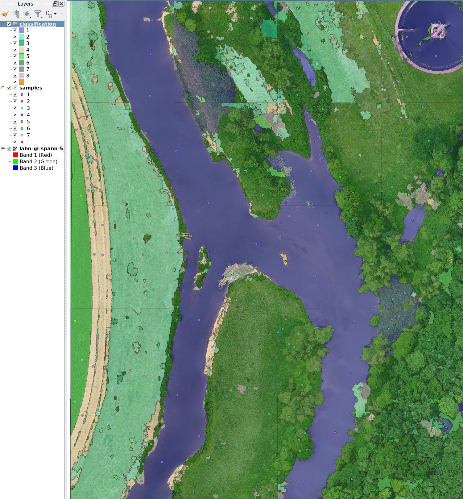

# Object-based Image Analysis (OBIA)

With UAV image data, which often have high spatial resolution but minimal spectral resolution, a shift in analytical thinking is required. Instead of classifying individual pixels, it is often more effective to identify meaningful objects. The core principle is: segment first, then classify.

## General Workflow

The example illustrates a typical OBIA classification procedure:

1. Data acquisition: orthophoto and training data.
2. Generation of spatial segments.
3. Extraction of descriptive features.
4. Model training.
5. Classification of the input dataset.

For reference, download the [base dataset](../images/module-hr-analysis/obia.zip) and the [QGIS model](../images/module-hr-analysis/obia1.model3).

::: {.callout-important}
Save the project beforehand, for example as `obia_test`, to keep relative paths stable. Manually delete intermediate files before each run and avoid relying on temporary files.
:::

## Step 1: Create Training Sample Points

Create a point vector file and digitize the following classes:

| class | CLASS_ID |
|---|---:|
| water | 1 |
| meadows | 2 |
| meadows-rich | 3 |
| bare-soil-dry | 4 |
| crop | 5 |
| green-trees-shrubs | 6 |
| dead-wood | 7 |
| other | 8 |

Provide at least 10 widely distributed sampling points per class and save the file as `sample.gpgk`.

## Step 2: Segmentation

In the QGIS Processing Toolbox, run `Segmentation` with the Mean-Shift algorithm. Inspect the resulting segments and adjust parameters if the result is unsatisfactory.

## Step 3: Feature Extraction

Use `ZonalStatistics` under OTB image manipulation to extract features.

## Step 4: Join Training Data with Segments

Use `Join Attributes by Location` to join training samples with segmented objects.

## Step 5: Training

Use `TrainVectorClassifier`, select the feature fields, set `CLASS_ID` as the class field, choose `libsvm`, and enable parameter optimization.

## Step 6: Classification

Use `VectorClassifier`, load the output vector into QGIS, and apply a style.

::: {layout-ncol=2}

:::

## Result

You should now see a mostly well-classified result, with some expected misclassifications.

Questions for reflection:

- What could cause the misclassifications?
- What are the weaknesses of this approach?
- How could the results be improved?

## Connected Module

- [Analysis of high resolution aerial data](../modules/module-hr-analysis.qmd)
