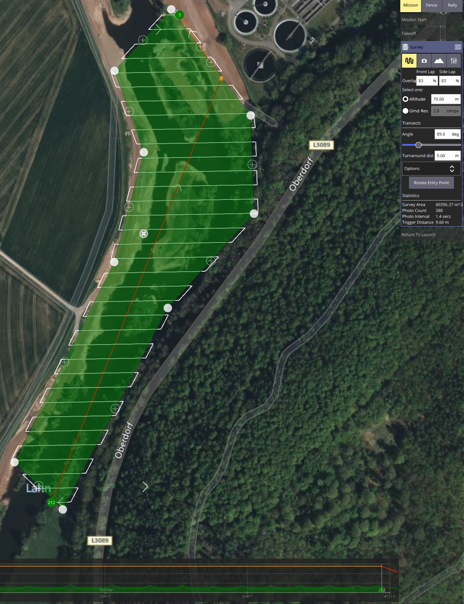
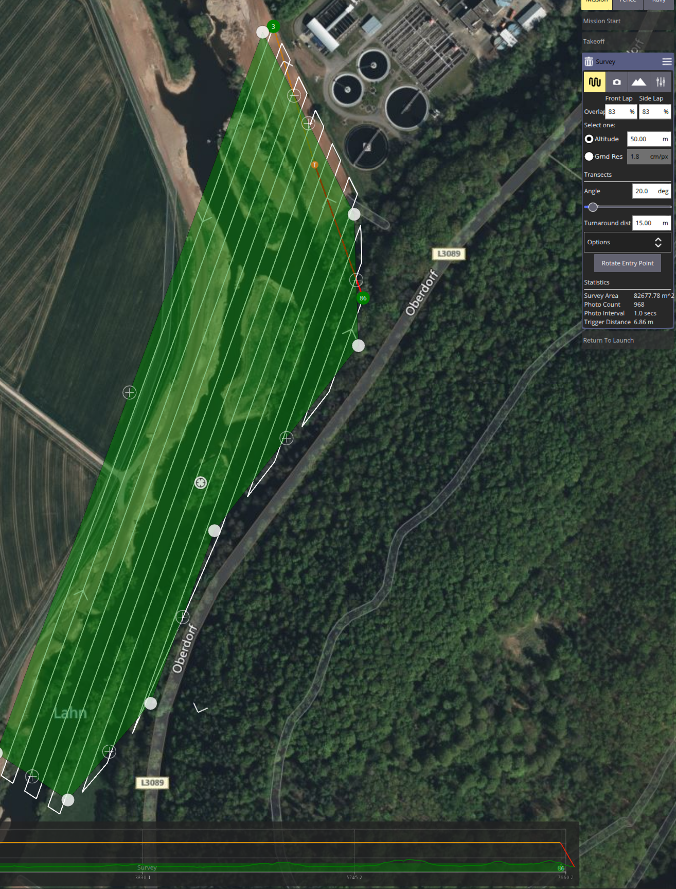
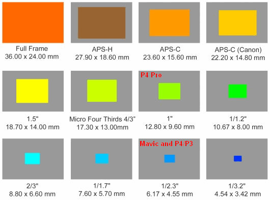
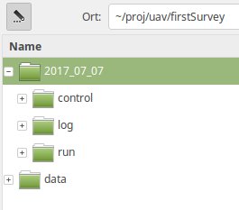
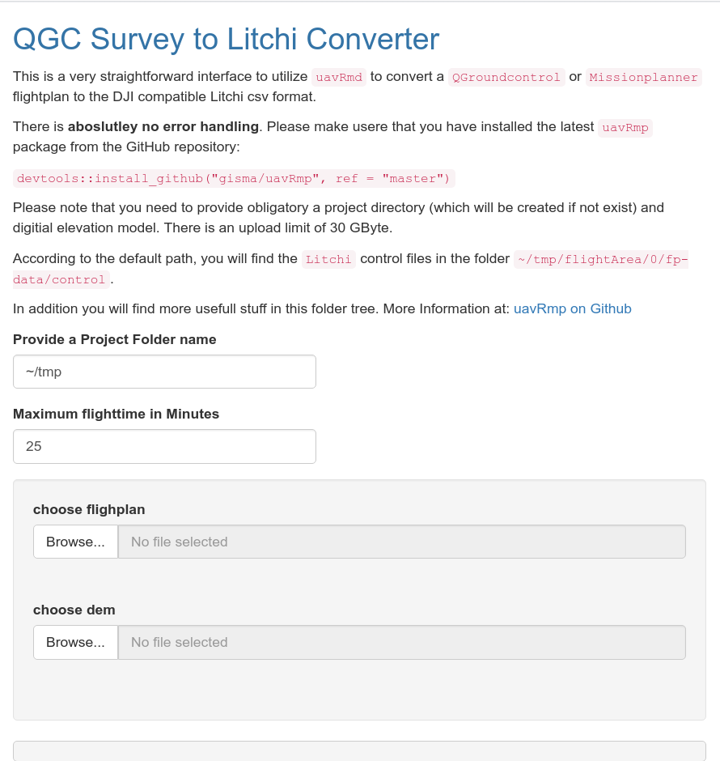

::: {.callout-warning}
You will have many chances to make a small mistake that can damage your UAV or involve people, animals, or assets. Check your risk and implement a double-check system while planning and performing autonomous flight missions. Operating autonomous UAVs is the full responsibility of the pilot.

Keep cool. Keep alert.
:::

# UAV Mission Planning - Practical Workflow

The open UAV community is focused on the PixHawk autopilot unit and the [MissionPlanner](http://qgroundcontrol.com/downloads/), or the more recent and platform-independent [QGroundControl](http://ardupilot.org/planner2/) software. Both are well documented and provide APIs and easy-to-use GUIs.

Nevertheless, they miss some planning capabilities, such as high-resolution terrain-following flight planning, dealing with battery-dependent task splitting, safe departures and approaches within the split main tasks, or exporting the tasks to DJI-compatible format. Other commercial competitors such as [UgCS](https://www.ugcs.com/) are powerful but cost intensive and complex.

## Basic Mission Planning Workflow

This tutorial deals with effective and safe planning of an autonomous flight. It provides basic information about hardware and software, supplemental data, and useful additions. The extended workflow gives further explanations and hints for improving your planning.

## Things You Need

- [Digital Surface Model](https://land.copernicus.eu/imagery-in-situ/eu-dem/eu-dem-v1.1/view). Account needed.
- [QGroundControl](http://qgroundcontrol.com/)
- [Step-by-step tutorial](https://docs.qgroundcontrol.com/master/en/PlanView/pattern_survey.html)
- [Airmap](https://app.airmap.com/), an easy-to-use application
- [flynex](https://app.flynex.io/), a complex professional application with extensive support

## General Workflow

1. Identify the area and digitize it.
2. Adjust the flight parameters to your needs and generate flight control files.
3. Convert and upload the mission control files either directly to your tablet or smartphone, or via the Litchi cloud.
4. Make an extensive pre-flight check.
5. Fly the mission.

## Aim of the Tutorial

The tutorial introduces the basic usage of `QGroundControl` and `uavRmp`.

The goal is to create flight plans for surveys over high relief-energy surfaces and terrain to generate orthophotos and point clouds.

### Digitizing the Survey Area Using QGroundControl's Survey Feature

We want to plan a flight in structured terrain in the upper Lahn valley. Start `QGroundControl`, navigate to the Mission tab, open `Pattern -> Survey`, digitize a pattern, and fill in the values in the right-side menus for camera angle, overlap, and related parameters.

::: {layout-ncol=2}



:::

You will produce much better results when you capture images from different above-ground levels (AGL) and different capturing angles. This can be realized by two different plannings. It is also useful to take nadir images and non-nadir images. A cross pattern flown at two different altitudes with varying nadir angles is much better than a single nadir-only pattern flight. To avoid horizon shots, the nadir angle should not be greater than roughly 5 to 10 degrees.

::: {.callout-warning}
During planning, observe all airspace and protected-area regulations. This is not only a legal issue, but also a matter of maximum safety.

Relevant links: [LBA legal information](https://www.lba.de/DE/Drohnen/Drohnen_node.html;jsessionid=7ECB1558F37F914B0EF93F2D54B8991B.live11311) and the [BMDV cheat card](https://www.bmvi.de/SharedDocs/DE/Anlage/LF/drohnen-flyer-regelungen-eu-und-deutschland.pdf?__blob=publicationFile).
:::

If you use a Pixhawk device, the QGroundControl workflow is sufficient at this point.

### Specific Settings for DJI Cameras

To derive a valid planning, we need to calculate the correct camera parameters. Typically camera parameters are standardized to the 35 mm full-frame sensor format. The DJI Mini 2 sensors have a size of 1/2.3 inch. The default setting of many point-and-shoot cameras is 16:9, which changes the sensor size because part of the height is cut.



The real focal length can be calculated approximately by dividing the equivalent focal length by the corresponding [crop factor](https://shuttermuse.com/calculate-cameras-crop-factor/).

```text
rF = eFL / cf

eFL = equivalent Focal Length
cf  = crop factor
rF  = real Focal Length

For the Mavic Mini 2:
rF = 24 / 5.6 = 4.285714
rF = 4.3
```

According to this, the camera specs for the DJI Mavic Mini 2 are:

Image Size 4:3, 4000 x 3000:

- Sensor Width: 6.17 mm
- Sensor Height: 4.77 mm
- Focal Length: 4.3 mm

Image Size 16:9, 4000 x 2250:

- Sensor Width: 6.17 mm
- Sensor Height: 4.56 mm
- Focal Length: 4.3 mm

You may also use a [depth of field calculator](https://www.cambridgeincolour.com/tutorials/dof-calculator.htm) to estimate the minimum distance of the camera to the target.

::: {.callout-note}
For DJI usage, save this flight plan to an appropriate folder and follow the instructions in the conversion chapter to create a Litchi-compatible mission file.

This workflow is valid for DJI aircraft only if the concrete aircraft, controller, operating system, and Litchi app generation support waypoint missions via the DJI SDK. For the Mini class up to the Mini 3 Pro, this mainly means:

- **Mavic Mini 1**
- **DJI Mini SE v1**
- **DJI Mini 2**
- **DJI Mini 3**
- **DJI Mini 3 Pro**

For **Mavic Mini 1, Mini SE v1, and Mini 2**, use the classic **Litchi for DJI Drones** app. For **Mini 3 and Mini 3 Pro**, use **Litchi Pilot**, not the classic Litchi app. Check this before the course because support depends on the exact controller and Android/iOS setup.
:::

## Conversion of the Flight Plan for Litchi-Compatible DJI Devices

The R package [`uavRmp`](https://github.com/gisma/uavRmp) bridges this gap. It generates MAVLINK-compliant mission files that can be uploaded to the Pixhawk controller via any Ground Control Station software. It also exports or converts QGroundControl plannings to the Litchi CSV format for DJI drones.

For DJI aircraft, this conversion is only the planning and file-generation step. The actual execution of the mission depends on whether the aircraft is supported by the relevant Litchi app through DJI SDK access. For the Mini class up to the Mini 3 Pro, the relevant distinction is:

- **Classic Litchi for DJI Drones:** Mavic Mini 1, Mini SE v1, Mini 2.
- **Litchi Pilot:** Mini 3 and Mini 3 Pro.

The classic Litchi app lists Mini 2, Mini SE v1, and Mavic Mini 1 as compatible aircraft, while Mini 3 and Mini 3 Pro are handled through Litchi Pilot instead. Litchi Pilot is still listed separately from the classic app and supports waypoint planning/execution for newer DJI models including Mini 3 and Mini 3 Pro. 

### Installation of R and uavRmp

First install R and preferably the RStudio IDE. You can use the [HowTo install R & RStudio](https://geomoer.github.io/moer-base-r/unit01/unit01-02_Installation.html) tutorial, or the [rig R installation manager](https://github.com/r-lib/rig#the-r-installation-manager). Then follow the [`uavRmp`](https://github.com/gisma/uavRmp) homepage and install the package.

```r
install.packages("uavRmp")
```

To install the current GitHub version, install `devtools` and the latest GitHub version of `link2GI`.

```r
install.packages("devtools")
devtools::install_github("gisma/uavRmp", ref = "master")
devtools::install_github("r-spatial/link2GI")
```

### Calling `makeAP` from `uavRmp`

There are many optional arguments that control generation of an autonomous flight plan. In this first use case, keep it simple. Results are stored in a fixed folder structure. The root folder is set by `projectDir`, for example `~/proj/uav`. The current working directory is generated from `locationName` and is always a subfolder of `projectDir`. The folder structure creates subfolders for log files, temporary data, and mission control files.

::: {.callout-note}
The mission control files are stored in a folder named `control`.
:::



Explanation of the used arguments:

- `useMP = TRUE` activates QGroundControl or MissionPlanner task files.
- `demFn = filenameDEM` sets path and file name for the DEM.
- `surveyArea = filenameFlightarea` sets path and file name of the QGroundControl flight plan.

The example below uses demo files from the package. To change it, provide the path and name of your DEM and planning file.

```r
library(uavRmp)

filenameDEM = system.file("extdata", "mrbiko.tif", package = "uavRmp")
filenameFlightarea = system.file("extdata", "tutdata_qgc_survey.plan", package = "uavRmp")

fp = makeAP(projectDir = "~/uav",
            useMP = TRUE,
            surveyArea = filenameFlightarea,
            demFn = filenameDEM,
            cameraType = "dji43",
            uavType = "dji_csv")
```

The script generates R objects for visualization, log files, and flight control files for running a mission on supported DJI/Litchi setups.

For a more comprehensive tutorial, see [Mission Planning on basis of QGroundControl](https://gisma.github.io/uavRmp/articles/uavRmp_2.html).

If you just want to convert flight plans from GroundControl to Litchi, you can use the Shiny GUI:

```r
library(uavRmp)
library(shiny)
runApp(system.file("shiny/plan2litchi/", "/app.R", package = "uavRmp"))
```

Navigate to the requested files and check the output. Be patient; it may take a while.



After checking the files, import the control file to the [Litchi Hub](https://flylitchi.com/hub) or to the corresponding Litchi/Pilot workflow used for the supported aircraft. You need an account.

::: {.callout-tip}
Ready to take off: that is your first flight plan.
:::

## Alternative Mission Planning with Dronelink-Compatible DJI Devices

Dronelink provides an alternative planning and execution environment for DJI aircraft. In contrast to the Litchi workflow described above, this is not a `QGroundControl` → `uavRmp` → Litchi CSV conversion workflow. Dronelink is used as its own mission planning system.

This means that the survey geometry, altitude logic, speed, camera actions, and flight direction must be defined and checked directly in Dronelink. The `QGroundControl` / `uavRmp` workflow can still be used as a reference for terrain-aware planning, camera geometry, overlap estimation, and mission validation, but the executable mission is created in Dronelink.

For DJI Mini-class drones up to the Mini 3 Pro, Dronelink support depends on the exact aircraft, controller, operating system, and app version. Relevant Mini-class models include:

- **Mavic Mini 1 / DJI Mini SE v1**
- **DJI Mini 2**
- **DJI Mini 3**
- **DJI Mini 3 Pro**

For Mini 3 and Mini 3 Pro, Dronelink currently documents Android-based support only: no iOS support, no DJI RC support, and installation via the correct Dronelink APK rather than the Google Play or Apple App Store version. Supported controller setups include DJI RC Pro for Mini 3 Pro and DJI RC-N1 with modern 64-bit Android devices for Mini 3 / Mini 3 Pro. :contentReference[oaicite:0]{index=0}

### Workflow Using Dronelink

1. Open the Dronelink web planner or app.
2. Create a new mission for the selected survey area.
3. Define the mission geometry, for example as a mapping grid, path, orbit, facade flight, or waypoint mission.
4. Set the relevant flight parameters:
   - altitude or terrain-following logic,
   - speed,
   - camera angle,
   - photo interval or capture mode,
   - overlap / spacing,
   - flight direction,
   - start and end behaviour.
5. Check all generated waypoints, camera actions, altitude changes, and turns.
6. Synchronize the mission to the mobile device or controller.
7. Perform the complete pre-flight check.
8. Execute the mission.

::: {.callout-note}
Dronelink is not used here as a target format for `uavRmp`. It is a separate mission planning environment. Use `QGroundControl` and `uavRmp` for planning comparison, terrain and camera-geometry checks, or teaching the structure of a survey mission, but create and verify the executable Dronelink mission inside Dronelink itself.
:::

::: {.callout-warning}
Do not assume that a DJI Mini drone is supported only because it belongs to the Mini series. Support is determined by the exact drone model, controller, mobile device, operating system, Dronelink app generation, and DJI SDK availability. Always test the complete setup with a short, low-risk mission before using it in the field.
:::

## Litchi vs. Dronelink – Practical Trade-Off

For DJI-based workflows, two fundamentally different approaches exist for executing planned missions:

### Litchi + uavRmp (File-Based Workflow)

- **Concept**: QGroundControl → `uavRmp` → Litchi CSV → Execution
- **Strengths**:
  - Direct transfer of planned flight geometry
  - Strong integration with external planning tools
  - Transparent and reproducible workflow
  - Well suited for teaching structured survey logic
- **Limitations**:
  - Technically fragile (format dependencies, import issues, SDK constraints)
  - Limited flexibility once the mission is generated
  - Dependent on exact Litchi compatibility

### Dronelink (System-Based Workflow)

- **Concept**: Mission is created and executed entirely within Dronelink
- **Strengths**:
  - Robust execution environment
  - High flexibility (mapping, waypoint, facade, orbit, adaptive missions)
  - Integrated terrain awareness and mission logic
- **Limitations**:
  - Higher cost (licensing required)
  - More complex interface and setup
  - No direct import of external mission files (manual reconstruction required)

### Practical Implication

- **Litchi + uavRmp** is technically more fragile, but highly efficient for transferring structured survey plans.
- **Dronelink** is more robust and flexible in operation, but more expensive and more complex to use.

For low-cost DJI Mini-class mission planning, there are essentially two practical approaches. The first is the file-based QGroundControl / uavRmp / Litchi workflow, where QGroundControl provides the actual planning power and uavRmp converts the resulting plan into a Litchi-compatible execution format. This approach is technically more fragile, but transparent, reproducible, and well suited for teaching mission-planning logic.

The second approach is Dronelink. Dronelink is more powerful as an integrated mission-planning environment, but it is also more complex and more expensive. It should be understood as a separate planning ecosystem, not as a simple replacement for the QGroundControl / uavRmp / Litchi workflow.


## Connected Module

- [Autonomous Flights Made Easy](../modules/module-fieldwork.qmd)
