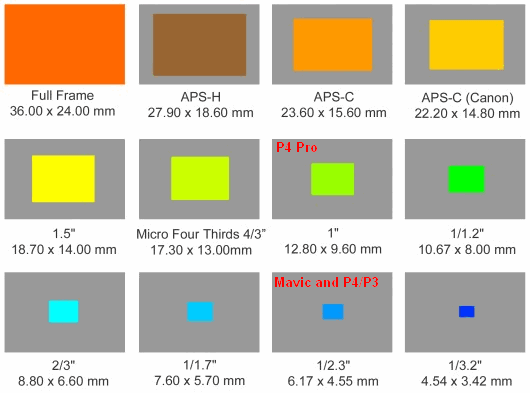
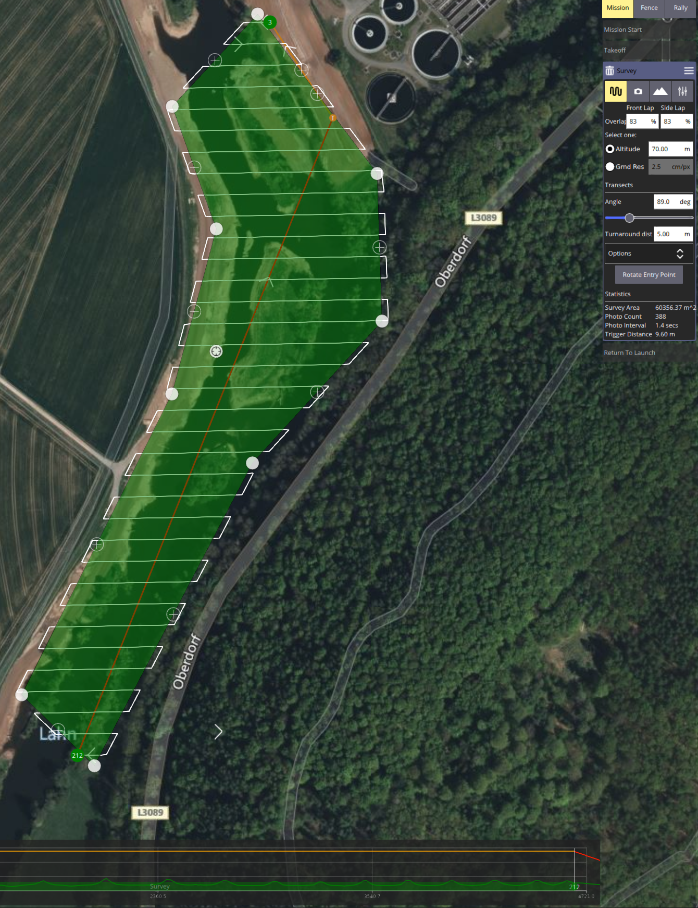
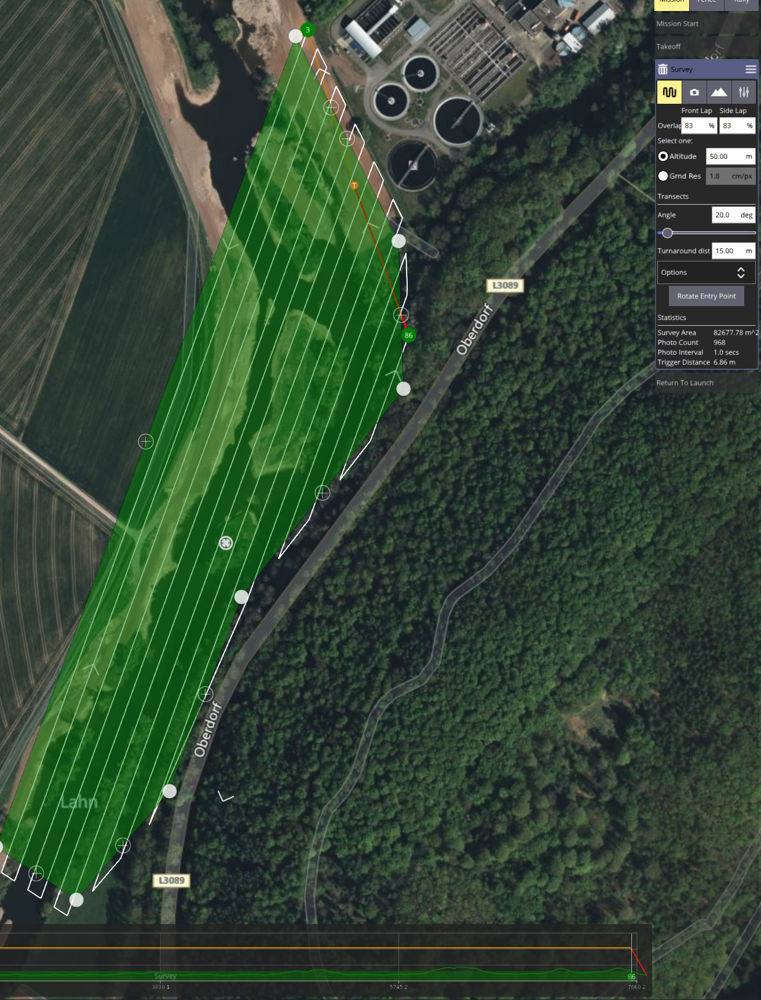
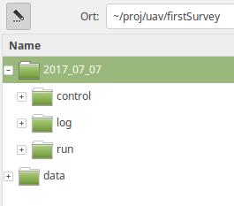
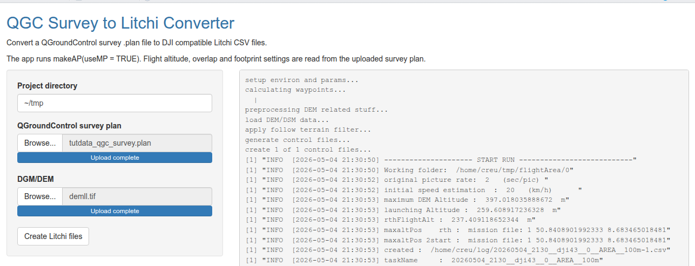

::: callout-warning
You will have many chances to make a small mistake that can damage your UAV or involve people, animals, or assets. Check your risk and implement a double-check system while planning and performing autonomous flight missions. Operating autonomous UAVs is the full responsibility of the pilot.

Keep cool. Keep alert.
:::

# UAV Mission Planning - Practical Workflow

This tutorial introduces practical UAV mission planning for mapping flights. The workflow has changed substantially since 2025. For many DJI-based mapping tasks, [Litchi Hub](https://hub.flylitchi.com/) is now the most practical low-budget baseline workflow because it provides browser-based mission planning, area mapping for photogrammetry, Google Earth based 3D planning, flight simulation, and direct planning support for common DJI workflows.

The older `QGroundControl` / `uavRmp` workflow remains relevant, but mostly as a legacy or special-purpose toolchain. It is still useful when missions must be generated reproducibly from GIS data, when terrain-following logic must be controlled explicitly, when Pixhawk-based platforms are used, or when mission formats need to be converted.

The goal of this page is therefore not to replace one workflow with another, but to distinguish clearly between:

- the contemporary Litchi-based baseline workflow,
- the legacy/special-purpose `QGroundControl` / `uavRmp` workflow,
- the legal airspace-check workflow.

## Basic Mission Planning Workflow

This tutorial deals with effective and safe planning of autonomous UAV mapping flights. It provides basic information about hardware and software, supplemental data, and useful additions. The extended workflow gives further explanations and hints for improving planning quality.

For ordinary DJI mapping tasks, start with Litchi Hub. Use the older `QGroundControl` / `uavRmp` workflow only when the mission requires external geospatial computation, explicit conversion, or Pixhawk-compatible output.

## Things You Need

**Data**

- [Digital Surface Model / Digital Elevation Model data](https://land.copernicus.eu/imagery-in-situ/eu-dem/eu-dem-v1.1/view). Account may be required.
- Any other Digital Surface Model or Digital Elevation Model data if available and suitable.

**Contemporary low-budget planning workflow**

- [Litchi Hub](https://hub.flylitchi.com/), browser-based mission planning for DJI workflows.
- [Litchi User Guide](https://flylitchi.com/help), official documentation for Litchi and Litchi Hub workflows.
- [Litchi Mission Hub / Litchi classic entry point](https://flylitchi.com/), mainly relevant for classic Litchi workflows and older mission management.

**Legacy / special-purpose planning workflow**

- [QGroundControl](https://qgroundcontrol.com/downloads/), an open source Ground Control Station for mission planning and mission upload. It is a mature and reliable tool, but for straightforward DJI mapping workflows it should now be considered mainly a legacy or special-purpose option.
- [QGroundControl Survey Tutorial](https://docs.qgroundcontrol.com/master/en/qgc-user-guide/plan_view/pattern_survey.html), step-by-step documentation for creating survey grid missions.
- [`uavRmp`](https://github.com/gisma/uavRmp), an `R` package for reproducible UAV mission generation and conversion.

**Legal checks**

- [DIPUL Map Tool](https://maptool-dipul.dfs.de/?language=en), the official German map tool for checking geographical drone zones.
- [TraX](https://droniq.de/en/drohnenapp-trax/), a drone flight planning and airspace-checking application for Germany.

## General Workflow

1. Identify the survey area.
2. Check legal restrictions using DIPUL and/or TraX.
3. Plan the mission in Litchi Hub if the task is a standard DJI mapping mission.
4. Use `QGroundControl` / `uavRmp` only if the mission requires external GIS-based planning, reproducible `R` generation, Pixhawk output, or conversion workflows.
5. Check flight altitude, overlap, camera angle, speed, terrain clearance, start behaviour, and return behaviour.
6. Upload or synchronize the mission to the relevant flight app.
7. Make an extensive pre-flight check.
8. Fly the mission under safe and legal field conditions.

## Aim of the Tutorial

The tutorial introduces the basic logic of UAV mission planning.

The practical goal is to create flight plans for surveys over high relief-energy surfaces and terrain to generate orthophotos and point clouds.

The current recommended entry point for DJI workflows is Litchi Hub. The `QGroundControl` / `uavRmp` workflow is retained as a second path because it explains the structure of survey missions very clearly and remains useful for special-purpose workflows.

# Contemporary Workflow: Mission Planning with Litchi Hub

Litchi Hub has become the simplest baseline tool for many DJI mapping flights. It allows mission planning directly in the browser and provides functions that previously required separate tools or conversion workflows.

Use Litchi Hub directly when:

- the survey area can be drawn or imported as a simple mapping polygon,
- the mission is a standard photogrammetry grid,
- overlap, speed, camera angle, and capture settings can be configured directly in Litchi,
- 3D visual planning and flight simulation are sufficient,
- the mission can be executed with the supported Litchi or Litchi Pilot app for the selected aircraft.

## Basic Litchi Hub Workflow

1. Open [Litchi Hub](https://hub.flylitchi.com/).
2. Log in with your Litchi account.
3. Create a new flight.
4. Select an appropriate flight type, for example an area mapping or waypoint-based mission.
5. Draw the survey area or import a suitable KML/KMZ mapping polygon.
6. Select the drone and camera profile if available.
7. Set flight altitude, speed, overlap, gimbal angle, and capture mode.
8. Check the generated flight lines and capture points.
9. Use the 2D/3D preview or Google Earth based planning view to inspect the mission.
10. Simulate the mission before flying.
11. Save the mission and synchronize it with the relevant Litchi flight app.
12. Perform a conservative field check before execution.

::: callout-warning
Litchi Hub is a planning tool, not a legal approval system. Always check the planned operation separately using DIPUL and/or TraX. Also check whether the selected drone, controller, mobile device, and Litchi app generation actually support the required waypoint or mapping workflow.
:::

## Litchi Hub and Elevation Data

Litchi Hub and the classic Litchi workflows support elevation-aware planning. However, do not confuse visual map overlays with terrain-following elevation models.

For terrain-aware missions, check the currently supported DEM workflow carefully. In classic Litchi documentation, DEM import is based on Esri ASCII Grid files (`.asc`) in the WGS-84 coordinate system. GeoTIFFs or DOMs may be useful as visual overlays, but they should not automatically be treated as terrain-following DEMs unless the current Litchi workflow explicitly uses them as elevation data.

::: callout-note
Practical rule: import or activate elevation data before finalizing the mapping mission, then inspect all altitudes and terrain clearances. Do not assume that a visually correct map overlay guarantees correct terrain-following behaviour.
:::

## Specific Settings for DJI Cameras

To derive a valid planning, camera parameters must be set correctly. Camera parameters are often standardized to the 35 mm full-frame sensor format. DJI Mini-class sensors are much smaller. The DJI Mini 2, for example, uses a 1/2.3 inch sensor. The default setting of many point-and-shoot cameras is 16:9, which changes the usable sensor height because part of the image height is cut.



The real focal length can be calculated approximately by dividing the equivalent focal length by the corresponding [crop factor](https://shuttermuse.com/calculate-cameras-crop-factor/).

```text
rF = eFL / cf

eFL = equivalent Focal Length
cf  = crop factor
rF  = real Focal Length

For the Mavic Mini 2:
rF = 24 / 5.6 = 4.285714
rF = 4.3
```

According to this, the camera specs for the DJI Mavic Mini 2 are:

Image Size 4:3, 4000 x 3000:

- Sensor Width: 6.17 mm
- Sensor Height: 4.77 mm
- Focal Length: 4.3 mm

Image Size 16:9, 4000 x 2250:

- Sensor Width: 6.17 mm
- Sensor Height: 4.56 mm
- Focal Length: 4.3 mm

You may also use a [depth of field calculator](https://www.cambridgeincolour.com/tutorials/dof-calculator.htm) to estimate the minimum distance of the camera to the target.

## Aircraft and App Compatibility

For DJI workflows, mission planning and mission execution are two different things. A flight may be planned in Litchi Hub, but execution depends on whether the concrete aircraft, controller, operating system, and Litchi app generation support the required waypoint or mapping mode.

For older DJI aircraft, use the classic **Litchi for DJI Drones** app where supported. For newer DJI models, especially Mini 3 and newer, Litchi distinguishes these workflows from the classic app and refers users to **Litchi Pilot**.

For the Mini class up to the Mini 3 Pro, this mainly means:

- **Mavic Mini 1**
- **DJI Mini SE v1**
- **DJI Mini 2**
- **DJI Mini 3**
- **DJI Mini 3 Pro**

For **Mavic Mini 1, Mini SE v1, and Mini 2**, use the classic **Litchi for DJI Drones** app if your device setup is supported.

For **Mini 3 and Mini 3 Pro**, use **Litchi Pilot**, not the classic Litchi app. Check this before the course because support depends on the exact controller and Android/iOS setup.

::: callout-warning
Do not assume that a DJI Mini drone is supported only because it belongs to the Mini series. Support is determined by the exact drone model, controller, mobile device, operating system, Litchi app generation, and DJI SDK availability. Always test the complete setup with a short, low-risk mission before using it in the field.
:::

# Legacy / Special-Purpose Workflow: QGroundControl and uavRmp

The open UAV community has traditionally focused on the Pixhawk autopilot ecosystem and on Ground Control Station software such as [Mission Planner](https://ardupilot.org/planner/) and [QGroundControl](https://qgroundcontrol.com/). Both are well documented and provide APIs and easy-to-use graphical interfaces.

However, depending on the task, they may still lack a simple low-budget workflow for high-resolution terrain-following flight planning, battery-dependent task splitting, safe departures and approaches within split mission chunks, or direct export to DJI-compatible mission formats. Commercial competitors such as [UgCS](https://www.ugcs.com/) are powerful, but cost-intensive and complex.

The R package [`uavRmp`](https://github.com/gisma/uavRmp) bridges this gap. It generates MAVLink-compliant mission files that can be uploaded to Pixhawk controllers via Ground Control Station software. It also exports or converts QGroundControl plannings to the Litchi CSV format for DJI drones.

Use this workflow when:

- you use a Pixhawk-based UAV,
- you need reproducible mission generation from `R`,
- the mission geometry comes from external GIS analysis,
- you need explicit control over DEM-based terrain following,
- you need to convert QGroundControl or Mission Planner output into Litchi-compatible formats,
- you want to teach or inspect the internal structure of survey missions.

## Digitizing the Survey Area Using QGroundControl's Survey Feature

We want to plan a flight in structured terrain in the upper Lahn valley. Start `QGroundControl`, navigate to the Mission tab, open `Pattern -> Survey`, digitize a pattern, and fill in the values in the right-side menus for camera angle, overlap, and related parameters.

::: {layout-ncol="2"}



:::

You will produce much better results when you capture images from different above-ground levels (AGL) and different capturing angles. This can be realized by two different plannings. It is also useful to take nadir images and non-nadir images. A cross pattern flown at two different altitudes with varying nadir angles is much better than a single nadir-only pattern flight. To avoid horizon shots, the nadir angle should not be greater than roughly 5 to 10 degrees.

::: callout-warning
During planning, observe all airspace and protected-area regulations. This is not only a legal issue, but also a matter of maximum safety.

Relevant links: [LBA legal information](https://www.lba.de/DE/Drohnen/Drohnen_node.html) and the [BMDV cheat card](https://bmdv.bund.de/SharedDocs/DE/Anlage/DG/drohnen-flyer-regelungen-eu-und-deutschland.pdf?__blob=publicationFile).
:::

If you use a Pixhawk device, the QGroundControl workflow may already be sufficient at this point.

## Conversion of the Flight Plan for Litchi-Compatible DJI Devices

For DJI aircraft, this conversion is only the planning and file-generation step. The actual execution of the mission depends on whether the aircraft is supported by the relevant Litchi app through DJI SDK access.

For the Mini class up to the Mini 3 Pro, the relevant distinction is:

- **Classic Litchi for DJI Drones:** Mavic Mini 1, Mini SE v1, Mini 2.
- **Litchi Pilot:** Mini 3 and Mini 3 Pro.

The classic Litchi app lists Mini 2, Mini SE v1, and Mavic Mini 1 as compatible aircraft, while Mini 3 and newer are handled through Litchi Pilot instead. Litchi Pilot is separate from the classic app and supports newer DJI models where DJI SDK access is available.

## Installation of R and uavRmp

First install R and preferably the RStudio IDE. You can use the [HowTo install R & RStudio](https://geomoer.github.io/moer-base-r/unit01/unit01-02_Installation.html) tutorial, or the [rig R installation manager](https://github.com/r-lib/rig#the-r-installation-manager). Then install `uavRmp`.

The recommended installation method for the current GitHub version is `pak`:

```r
install.packages("pak")
pak::pak("gisma/uavRmp")
```

If `pak` is already installed, use:

```r
pak::pak("gisma/uavRmp")
```

The CRAN version can be installed with:

```r
install.packages("uavRmp")
```

The older `devtools::install_github()` workflow is no longer the recommended installation method, but may still work in existing development environments:

```r
install.packages("devtools")
devtools::install_github("gisma/uavRmp", ref = "master")
```

If `link2GI` is required for your local workflow, install it separately:

```r
pak::pak("r-spatial/link2GI")
```

## Calling `makeAP()` from `uavRmp`

There are many optional arguments that control generation of an autonomous flight plan. In this first use case, keep it simple. Results are stored in a fixed folder structure. The root folder is set by `projectDir`, for example `~/proj/uav`. The current working directory is generated from `locationName` and is always a subfolder of `projectDir`. The folder structure creates subfolders for log files, temporary data, and mission control files.

::: callout-note
The mission control files are stored in a folder named `control`.
:::



Explanation of the used arguments:

- `useMP = TRUE` activates QGroundControl or Mission Planner task files.
- `demFn = filenameDEM` sets path and file name for the DEM.
- `surveyArea = filenameFlightarea` sets path and file name of the QGroundControl flight plan.

The example below uses demo files from the package. To change it, provide the path and name of your DEM and planning file.

```r
library(uavRmp)

filenameDEM = system.file("extdata", "mrbiko.tif", package = "uavRmp")
filenameFlightarea = system.file("extdata", "tutdata_qgc_survey.plan", package = "uavRmp")

fp = makeAP(projectDir = "~/uav",
            useMP = TRUE,
            surveyArea = filenameFlightarea,
            demFn = filenameDEM,
            cameraType = "dji43",
            uavType = "dji_csv")
```

The script generates R objects for visualization, log files, and flight control files for running a mission on supported DJI/Litchi setups.

For a more comprehensive tutorial, see [Mission Planning on basis of QGroundControl](https://gisma.github.io/uavRmp/articles/uavRmp_2.html).

If you just want to convert flight plans from QGroundControl to Litchi, you can use the Shiny GUI:

```r
library(uavRmp)
library(shiny)
runApp(system.file("shiny/plan2litchi/", "app.R", package = "uavRmp"))
```

Navigate to the requested files and check the output. Be patient; it may take a while.



After checking the files, import the control file to the relevant Litchi workflow. For older workflows this may be the classic [Litchi Mission Hub](https://flylitchi.com/hub). For newer workflows, use [Litchi Hub](https://hub.flylitchi.com/) or the corresponding Litchi Pilot workflow used for the supported aircraft. You need a Litchi account.

::: callout-tip
Ready to take off: that is your first converted flight plan.
:::


# Litchi vs. QGroundControl/uavRmp 

For DJI-based workflows, three fundamentally different approaches exist for executing planned missions.

## Litchi Hub / Litchi Pilot

- **Concept:** Plan and manage the mission directly in the Litchi ecosystem.
- **Strengths:**
  - Current low-budget baseline workflow for many DJI mapping flights.
  - Browser-based planning.
  - Area mapping / photogrammetry support.
  - 3D planning and simulation.
  - KML/KMZ mapping area import.
  - Direct connection to Litchi execution workflows.
- **Limitations:**
  - Depends on exact drone, controller, operating system, and Litchi app generation.
  - Terrain and elevation workflows must be checked carefully.
  - Not a legal airspace approval system.
  - Less transparent than code-based mission generation.

## QGroundControl + uavRmp

- **Concept:** QGroundControl / Mission Planner -> `uavRmp` -> Litchi CSV or MAVLink output.
- **Strengths:**
  - Transparent and reproducible.
  - Strong integration with external GIS and `R`.
  - Useful for Pixhawk workflows.
  - Useful for teaching mission-planning logic.
  - Useful for explicit DEM and conversion workflows.
- **Limitations:**
  - Now mostly legacy or special-purpose for straightforward DJI workflows.
  - Technically fragile because of format dependencies, import issues, and SDK constraints.
  - More complex than direct Litchi Hub planning.

## Practical Implication

For ordinary DJI mapping missions, start with Litchi Hub.

Use `QGroundControl` / `uavRmp` when the mission has to be computed from geospatial data, converted between formats, generated reproducibly from `R`, or used with Pixhawk-based systems.

# Legal and Airspace Checks

Mission planning and legal checking are separate tasks.

Litchi Hub can create and preview the technical mission. It does not replace a legal check of German geographical zones, protected areas, airspace restrictions, local constraints, or operational category requirements.

Use:

- [DIPUL Map Tool](https://maptool-dipul.dfs.de/?language=en) for official German geographical drone zones.
- [TraX](https://droniq.de/en/drohnenapp-trax/) for drone mission and airspace checking in Germany.

For mapping flights, draw or approximate the planned operation conservatively in the legal checking tool. Use the maximum planned altitude and the full operational area, not only the central flight path.

::: callout-warning
A technically valid Litchi mission is not automatically a legally valid flight. Always separate technical mission planning from legal operation checking.
:::

## Connected Module

- [Autonomous Flights Made Easy](../modules/module-fieldwork.qmd)

[1]: https://forum.flylitchi.com/t/open-beta-litchi-hub/23994?utm_source=chatgpt.com "[OPEN BETA] Litchi Hub"
