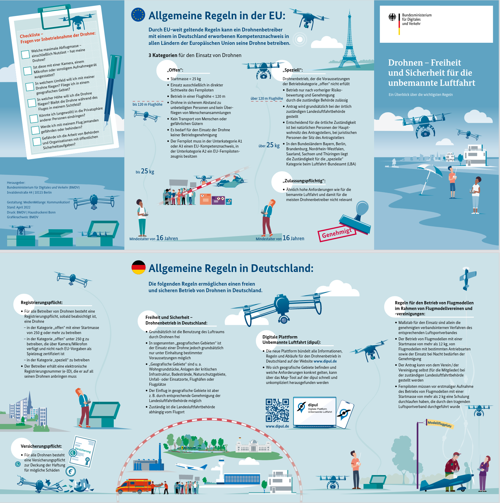

# General Regulations - German Drone Regulation from July 2021 [LuftVO §21h]

Following the new [EU Drone Regulation 2021](https://www.easa.europa.eu/domains/civil-drones) (2019/947 and 2019/945), Germany now also adopts the EU requirements and implements them into German law (Luftverkehrs-Ordnung, LuftVO). This means changes for all drone pilots and UAS operators after the introduction of the EU Drone Regulation 2021, given in [LuftVO §21h](https://www.gesetze-im-internet.de/luftvo_2015/__21h.html).

The most important rules in German are summarized in the cheat sheet of the Bundesministerium für Digitales und Verkehr.

Copyright: Bundesministerium für Digitales und Verkehr. [Online source](https://www.bmvi.de/SharedDocs/DE/Anlage/LF/drohnen-flyer-regelungen-eu-und-deutschland.pdf?__blob=publicationFile)

Since there is no English version of the cheat sheet, the following text lists the rules relevant for the course framework. Relevant information is also available at the central internet platform [DIPUL](https://www.dipul.de/homepage/de/).

::: {.callout-note}
The pilot is responsible, always.
:::

## Registration Operator of the UAV

Registration of the drone operator is required within the EU in the respective country. In Germany, registration is done online at the [Luftfahrtbundesamt](https://uas-registration.lba-openuav.de/#/registration/uasOperator) (LBA). Additional registration of the drone itself is not required. The eID (UAS operator ID) assigned during registration must be visibly attached to each owned drone.

## Liability Insurance

For almost all UAVs there is an insurance obligation for drone liability insurance.

## Specific Regulations for UAVs under 250 g

UAVs less than 250 grams are operated in the [EU OPEN A1](https://www.easa.europa.eu/domains/civil-drones/drones-regulatory-framework-background/open-category-civil-drones) category. Therefore no EU drone license is required. Flying in the vicinity of people and uninvolved persons is allowed, but crowds or gatherings of people must not be flown over. If uninvolved persons are unexpectedly overflown, this overflight must be terminated as soon as possible.

## Distance to Airfields and Airports

- A lateral distance of 1 kilometer applies to commercial airports, measured to the fence. In the extension of the runway, the flight corridor requires 5 kilometers in length and 2 kilometers in width for each runway.
- A general buffer of 1.5 kilometers applies to airfields, starting at the fence of the airfield.
- Helipads and heliports are usually treated equivalent to airfields, with a 1.5 km buffer.

Exception permits:

- For airports, an exception permit must be applied for at the responsible state aviation authority.
- For airfields and heliports, simple clearance from air traffic control is sufficient.

## Residential Areas and Residential Properties

Residential areas and residential property may be overflown at an altitude between 100 and 120 meters if:

- an overflight is absolutely necessary and cannot be conducted over public areas such as roads,
- a justified interest exists,
- obtaining permission from local residents is unreasonable,
- the flight takes place between 6:00 a.m. and 10:00 p.m.,
- there is no increased noise nuisance,
- privacy is maintained,
- residents have been informed as far as possible.

For an exception to these regulations, an exception permit must still be applied for from the relevant state aviation authority.

## Distance to Traffic Routes

The minimum distance of 100 meters may be undercut if a minimum distance of 10 meters is always maintained and the 1:1 rule is applied: lateral distance must be greater than or equal to above-ground level. Shipping lanes and federal waterways may be flown over quickly at an altitude between 100 and 120 meters if there are no ships, locks, or facilities in the vicinity.

Exception permits must be applied for from the operator of the respective traffic routes.

## Nature Reserves

Nature reserves may be flown over if:

- the drone flies exclusively at an altitude between 100 and 120 meters,
- there is a legitimate interest and commercial background,
- the protective concept of the nature reserve is known and respected,
- the overflight is necessary for the purpose of operation.

Exemption permits can be issued by the competent aviation authority or the nature conservation authority.

## Further Distance Rules

Drones must keep 100 meters lateral distance to accident scenes, operation sites, industrial facilities, prisons, military facilities and organizations, facilities for centralized power generation and distribution, police or constitutional bodies, military maneuvers, and hospitals.

## Connected Module

- [Autonomous Flights Made Easy](../modules/module-fieldwork.qmd)
