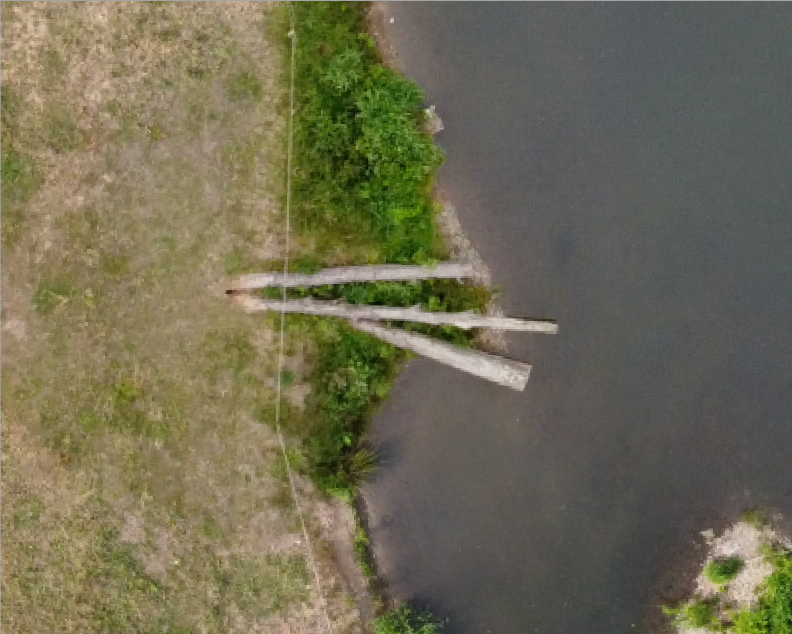
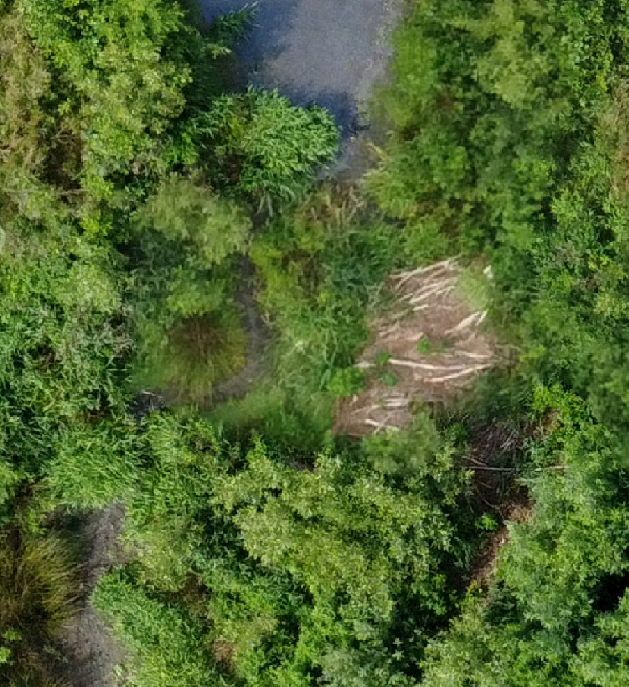
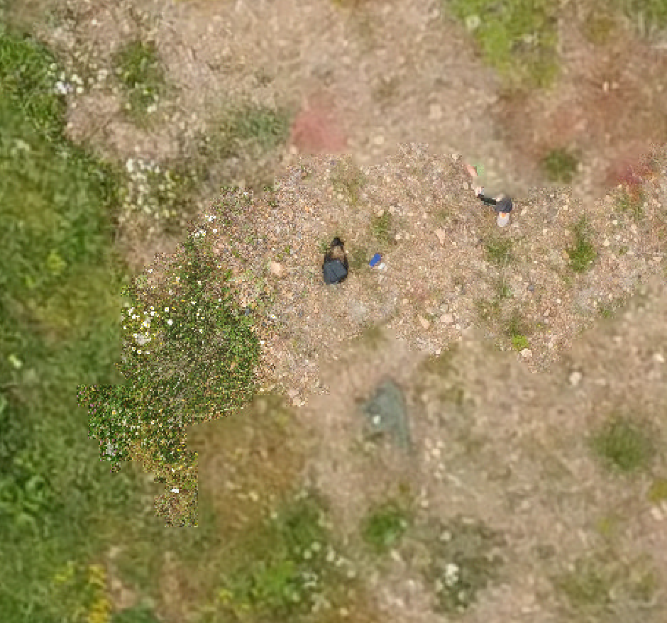
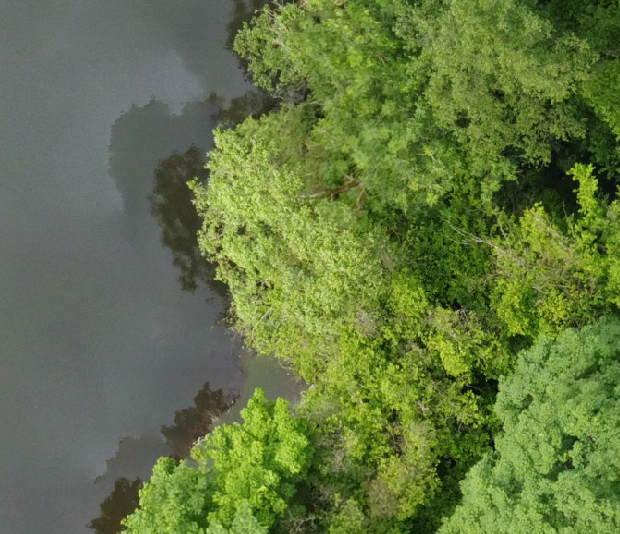
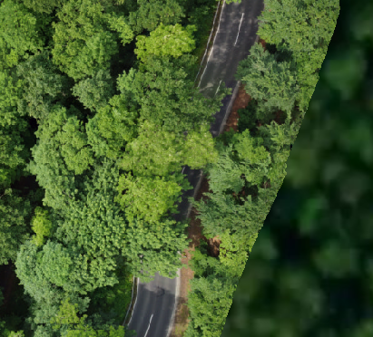

A feasibility study was conducted using the [Gisselberger Spannweite](https://www.marburg.de/portal/seiten/renaturierungsmassnahme-gisselberger-spannweite-900002083-23001.html) as a representative example.
The goal of this test was to evaluate the proposed workflow for efficiency and suitability in acquiring orthoimages with a ground resolution of < 2.5 cm using low-cost mini-UAVs (< 250 g), with minimal effort.
The resulting orthoimages and point clouds serve as foundational datasets for monitoring river restoration projects and similar applications.

# Methods and Implementation

## UAV Hardware Used

Mini-UAVs with a take-off weight below 250 g are particularly well-suited for such tasks due to the following advantages:

* No EU A1/A3 drone license required
* Legal flights under category OPEN A1 are possible — including close proximity (30 m) to uninvolved individuals and flights over residential areas — provided all regulations and no-fly zones are observed
* Only mandatory requirements: pilot registration (UAS operator ID/e-ID) and liability insurance

For this study, the `DJI Mavic Mini 2` was used, which is well-supported by the `Litchi` software and offers reliable straight-line and descent flight capabilities.
An alternative, the more affordable `Xiaomi Fimi X8 Mini`, could likely yield comparable results with minor adjustments.
In general, most high-quality mini-UAVs should suffice.
Note, however, that drones heavier than 250 g require significantly more planning and are subject to stricter legal obligations.

## Flight Planning

The flight plan followed a standardized dual-altitude strategy (50 m and 70 m AGL) with a 5° tilted nadir angle.
Planning was performed in `QGroundControl` using the `DJI Mini 2` camera configuration.
Flight restrictions derived from `Airmap` were considered and converted to `Litchi Mission Hub` missions via the `R` package `uavRmp`.

Using `Litchi Mission Hub`, each waypoint was reviewed and adjusted manually (Settings → Use Online Elevation).
This manual step is **obligatory** to ensure safe flights, maximize coverage, and stay within the 20-minute battery limit.

The full onsite acquisition (setup, flight, teardown) took approximately one hour.

### Lengthwise Flight

<iframe src="https://flylitchi.com/hub?m=cg0TRo2KdE" height="600px" width="100%" frameborder="0" onload="resizeIframe(this)" ></iframe>

### Cross Flight

<iframe src="https://flylitchi.com/hub?m=GoaB3rae3J" height="600px" width="100%" frameborder="0" onload="resizeIframe(this)" ></iframe>

## Post-Processing (Agisoft Metashape)

Processing was carried out using `Ortho+ -> Best Practice -> Ortho-no-GPS` within Metashape.
The target ground resolution was set to 1.5 cm. No advanced tuning options were used for this demo, meaning that further improvements are likely possible.

# Results

The first evaluation step focuses on visual inspection — especially image quality, the occurrence of artifacts, and positional accuracy.

## Ground Resolution – What’s "Real"?

Metashape reports a ground resolution of about 1.4 cm, based on the two flight altitudes.
The full-resolution orthoimage has a file size of ~2.4 GB.
A resampled version at 5 cm resolution is only ~210 MB.

Compare the visual differences in the cutout images below:

::: {layout-ncol=2}
[{fig-alt="Original 1.5 cm resolution"}](../images/module-postprocessing/trees_1_5cm.png)

[{fig-alt="Resampled to 5 cm resolution"}](../images/module-postprocessing/trees_5cm.png)
:::

The core question becomes: what resolution is *reasonable* and *manageable* — full detail at 1.5 cm or resampled 5 cm?
There is no universal answer. It depends on your analysis goal and method.
Often, highest resolution ≠ best result — especially considering non-linear increases in data volume.

## Typical Visual Issues

The following panel illustrates typical artifacts:

::: {layout="[[1,1],[1,1]]"}
{width=420 fig-alt="Motion blur or vertical displacements" .lightbox}

{width=420 fig-alt="Oversampling from redundant images" .lightbox}

{width=420 fig-alt="Shadow duplication" .lightbox}

{width=420 fig-alt="Edge distortion due to insufficient image overlap" .lightbox}
:::

## Overall Visual Inspection

Below, you’ll find an interactive [Cesium-Ion](https://cesium.com/platform/cesium-ion/) map with the full 5 cm orthoimage.
Compare the *three trees* section again to assess rendering performance.

<iframe src="../images/module-postprocessing/cesium_ortho_1.html" height="800px" width="100%" frameborder="0" onload="resizeIframe(this)" ></iframe>
*Note: Cesium resamples images for performance, so quality may appear reduced.*

## Further Products

Beyond orthoimages, dense 3D point clouds are a key output and — depending on the context — comparable to LiDAR data in information content.

Such models are ideal for participatory planning, public outreach, and environmental monitoring.

### 3D Model

Below is a shaded 3D mesh (raw, unfiltered).

<iframe src="../images/module-postprocessing/cesium_ortho_2.html" height="850px" width="100%" style="border:none;"></iframe>

Note: For Cesium display, mesh models must be manually aligned in 3D space. Minor inaccuracies in placement may still be visible.

### 3D Point Cloud

Here is a reduced version (factor 30) of the point cloud rendered in Cesium:

<iframe src="../images/module-postprocessing/cesium_ortho_3.html" height="850px" width="100%" style="border:none;"></iframe>
*Despite heavy downsampling, the model clearly reveals 3D structure of vegetation and terrain.*

Also available as a Sketchfab model:

<iframe
  title="Gisselberger Spannweite"
  src="https://sketchfab.com/models/c38b78f3c0b04102abe46f92cb5c4fd9/embed?ui_theme=dark"
  width="100%"
  height="600"
  frameborder="0"
  allow="autoplay; fullscreen; xr-spatial-tracking"
  allowfullscreen
  mozallowfullscreen="true"
  webkitallowfullscreen="true"
  xr-spatial-tracking
  execution-while-out-of-viewport
  execution-while-not-rendered
  web-share
  style="border: none;"
></iframe>

*Note: Rendering capabilities vary depending on the 3D engine.*

# Conclusions

The presented case study illustrates that using a mini-UAV, efficient flight planning, and standardized processing workflows can produce reproducible and accurate orthoimages and point clouds.
This method shows great potential for low-cost, non-invasive environmental monitoring — especially in sensitive or inaccessible areas.
